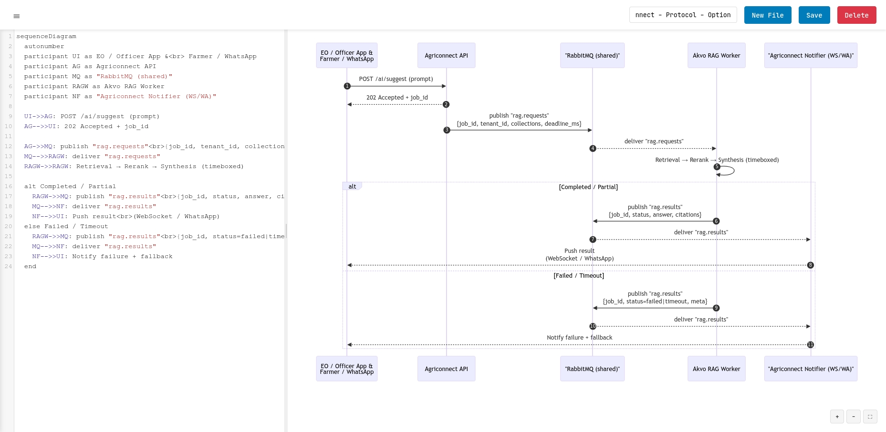
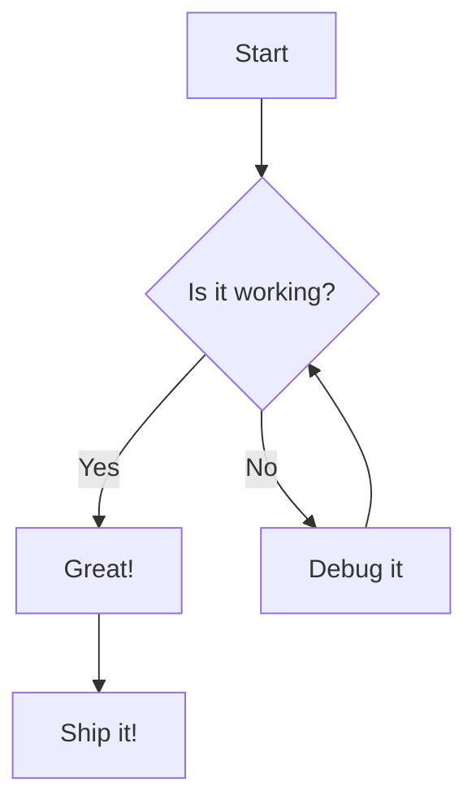

# Mermaid Live Editor with Authentication

A modern, feature-rich live editor for Mermaid diagrams with built-in user authentication, admin panel, and export capabilities. Create, edit, and preview Mermaid diagrams with syntax highlighting, zoom controls, file management, and multi-user support — all running entirely in your browser with no backend server required!

**[🚀 Live Demo](https://dedenbangkit.github.io/mermaid-live-editor/)**

> **Note**: This project is a fork of [dedenbangkit/mermaid-live-editor](https://github.com/dedenbangkit/mermaid-live-editor/) with additional features including user authentication, admin panel, and export capabilities.



## Features

### 🔐 **Authentication & User Management**
- Secure login system with SHA-256 password hashing (Web Crypto API)
- Session-based authentication using `sessionStorage`
- Role-based access control (Admin & User roles)
- Admin panel for managing users (add, delete, view)
- Password hash generator tool for easy user configuration
- Config-based users (`users.js`) merged with localStorage-managed users
- Auto-redirect to login page for unauthenticated access

### 🎨 **Modern Interface**
- Clean, responsive design with compact collapsible sidebar (256px)
- Side-by-side code editor and live preview
- Resizable panels to customize your workspace
- Collapsible editor panel for full-screen preview
- Minimal header with clean typography (Google Fonts: Inter & JetBrains Mono)
- Inline diagram title editing with rename icon
- User display name and role indicator in header
- Line separators for cleaner file list

### 📝 **Advanced Editor**
- Syntax highlighting with CodeMirror
- Line numbers and bracket matching
- Horizontal and vertical scrolling
- Auto-indentation and code formatting
- Real-time preview updates as you type

### 🔍 **Preview Controls**
- Zoom in/out with mouse wheel or buttons
- Pan by clicking and dragging
- Reset zoom to fit view
- Smooth zoom transitions

### 📤 **Export Capabilities**
- Export diagrams as high-resolution PNG (2x DPI)
- Automatic SVG fallback if PNG export fails
- Smart filename generation from diagram name
- Works both on HTTP server and local file access

### 💾 **File Management**
- Save and load multiple diagram files
- Smart file sorting by last modified (most recent first)
- Detailed timestamps with relative time format (e.g., "5m ago", "2h ago")
- Quick rename with inline editing
- Delete files with confirmation
- Auto-save on rename or edit
- Persistent storage using IndexedDB (browser storage)

### 👨‍💼 **Admin Panel**
- Dashboard with user statistics (total users, admins, regular users)
- Add new users with username, password, and role assignment
- Delete locally-managed users
- View user types (Config vs Local)
- SHA-256 hash generator tool for manual configuration
- Protected access — admin role required

### 🌐 **No Backend Server Required**
- Runs entirely in your browser
- All data stored locally using IndexedDB and localStorage
- Authentication handled client-side with SHA-256 hashing
- No server setup or installation needed
- Works offline after first load
- Can be hosted on any static file server

### 📚 **Interactive Cheatsheet**
- Comprehensive examples of all Mermaid diagram types
- Opens in new tab (preserves your work in the editor)
- Clean sidebar navigation to jump to examples
- Live rendered diagrams with copy-to-clipboard functionality
- Matching theme and typography with main editor

## Quick Start

### Default Credentials

The application comes pre-configured with two users:

| Username | Password | Role |
|----------|----------|------|
| `admin` | `AdminIoT2026` | Admin |
| `user` | `User1234` | User |

> ⚠️ **Important**: Change these default passwords before deploying! Use the Hash Generator in the Admin panel or run the following in your browser console:
> ```javascript
> async function h(p){const m=new TextEncoder().encode(p);const b=await crypto.subtle.digest('SHA-256',m);return Array.from(new Uint8Array(b)).map(x=>x.toString(16).padStart(2,'0')).join('')}
> h('your_new_password').then(console.log)
> ```
> Then update the `passwordHash` value in `assets/js/users.js`.

### Option 1: Open Locally
Simply open `login.html` in your web browser. You will be redirected to the login page.

### Option 2: Run with Python HTTP Server
```bash
# Clone the repository
git clone https://github.com/dedenbangkit/mermaid-live-editor.git
cd mermaid-live-editor

# Start a simple HTTP server (Python 3)
python -m http.server 8000

# Or with Python 2
python -m SimpleHTTPServer 8000
```

Then open your browser and navigate to: `http://localhost:8000`

### Option 3: Use with Live Server (VS Code)
1. Install the "Live Server" extension in VS Code
2. Right-click on `login.html`
3. Select "Open with Live Server"

### Option 4: Deploy to Cloudflare Pages (via Wrangler CLI)
This project includes `wrangler.toml` configuration for easy deployment to Cloudflare Pages:

```bash
# Install Wrangler CLI globally
npm install -g wrangler

# Login to your Cloudflare account
wrangler login

# Deploy directly (no build step needed)
wrangler pages deploy . --project-name=mermaid-live-editor

# Or use the dev command to test locally first
wrangler pages dev .
```

### Option 5: Deploy to Cloudflare Pages (via Dashboard)
1. Push your code to a GitHub/GitLab repository
2. Go to [Cloudflare Dashboard](https://dash.cloudflare.com/) → Pages
3. Click "Create a project" → "Connect to Git"
4. Select your repository
5. Set build settings:
   - **Framework preset**: None
   - **Build command**: (leave empty)
   - **Build output directory**: `.`
6. Click "Save and Deploy"

### Option 6: Deploy to Other Static Hosting
This application can be deployed to any static hosting service:
- **GitHub Pages**: Push to a repository and enable GitHub Pages
- **Netlify**: Drag and drop the folder to Netlify
- **Vercel**: Deploy with a single command
- Or any other static hosting provider

## Usage

### Logging In
1. Open the application in your browser
2. Enter your username and password on the login page
3. Click "Masuk" (Login) or press Enter
4. You will be redirected to the editor

### Creating Diagrams
1. Click the hamburger menu (☰) to toggle the sidebar
2. Click **New** button to create a new diagram
3. Click the rename icon (✏️) next to the diagram title to change the name
4. Write your Mermaid code in the editor
5. Watch the live preview update automatically
6. Click **Save** to store your diagram (or Ctrl/Cmd+S)

### Managing Files
- **Rename**: Click the pencil icon next to the diagram title, edit inline, press Enter or click outside to save
- **Open**: Click any file in the sidebar to open it (sorted by last modified)
- **Save**: Click the Save button to update the current diagram
- **Save As New**: Click the copy icon to duplicate the diagram
- **Delete**: Click the trash icon on any file in the list (hover to reveal)
- **New**: Click the New button to start a fresh diagram

### Exporting Diagrams
- Click the **Export PNG** button in the preview header to download your diagram as a high-resolution PNG image
- If PNG export fails (e.g., on `file://` protocol), the diagram will be exported as SVG instead

### Admin Panel (Admin Users Only)
1. Click the **Admin** button in the header (visible only for admin users)
2. View user statistics on the dashboard
3. Add new users with the form
4. Delete locally-created users from the table
5. Use the Hash Generator to create password hashes for manual `users.js` edits

### Keyboard Shortcuts
- **Ctrl/Cmd + S**: Save current diagram
- **Ctrl/Cmd + N**: Create new diagram
- **Ctrl/Cmd + B**: Toggle sidebar
- **Ctrl/Cmd + E**: Toggle editor (collapse/expand)
- **Enter**: Confirm rename
- **Escape**: Cancel rename

### Navigation
- **Zoom**: Use the +/- buttons or mouse wheel in the preview
- **Pan**: Click and drag in the preview area
- **Reset**: Click the reset button (⛶) to fit the diagram
- **Resize**: Drag the divider between code and preview panels
- **Cheatsheet**: Click the "Cheatsheet" button to open examples in a new tab
- **Logout**: Click the "Logout" button to sign out and return to the login page

## Supported Mermaid Diagrams

This editor supports all Mermaid diagram types:

- **Flowcharts** - Decision trees and process flows
- **Sequence Diagrams** - Interaction timelines
- **Gantt Charts** - Project timelines
- **Class Diagrams** - Object-oriented structures
- **State Diagrams** - State machines
- **Entity Relationship Diagrams** - Database schemas
- **User Journey** - User experience flows
- **Git Graphs** - Version control workflows
- **Pie Charts** - Data visualization
- **Requirement Diagrams** - System requirements

## Example

Here's a simple flowchart to get you started:



## Architecture

### Frontend-Only Application
- **login.html**: Login page with authentication form
- **index.html**: Main editor with clean, compact UI (auth-protected)
- **admin.html**: Admin panel for user management (admin-only access)
- **cheatsheet.html**: Interactive examples and documentation
- **CodeMirror**: Syntax highlighting and editor features
- **Mermaid.js v10.6.1**: Diagram rendering engine
- **IndexedDB**: Browser-based persistent storage for diagrams
- **localStorage**: Storage for custom users (managed via Admin panel)
- **sessionStorage**: Session-based authentication state
- **Tailwind CSS (CDN)**: Utility-first styling
- **Google Fonts**: Inter (UI) & JetBrains Mono (code)
- **Vanilla JS**: No framework dependencies, no build process required

### Authentication Flow
1. User enters credentials on `login.html`
2. Password is hashed using SHA-256 (Web Crypto API)
3. Hash is compared against stored hashes in `users.js` and localStorage
4. On success, auth state and user info are stored in `sessionStorage`
5. Protected pages (`index.html`, `admin.html`) check auth state on load
6. Unauthenticated users are redirected to `login.html`
7. Non-admin users trying to access `admin.html` are redirected to `index.html`

### User Management
- **Config Users**: Defined in `assets/js/users.js` — managed by editing the file directly
- **Local Users**: Created via Admin panel — stored in browser's `localStorage`
- Both user types are merged at runtime
- Config users cannot be deleted via Admin panel (must edit `users.js`)
- Local users can be added/deleted via Admin panel

### Storage
- **Diagrams**: Stored locally in your browser using IndexedDB
- **Custom Users**: Stored in localStorage (managed via Admin panel)
- **Session Data**: Stored in sessionStorage (cleared on tab close)
- Data persists across browser sessions (except session data)
- Each browser/device has its own independent storage
- No server communication required
- Automatic tracking of creation and modification times

### Data Structures

**Diagram (IndexedDB)**:
```json
{
  "id": "file_timestamp",
  "name": "diagram_name",
  "content": "mermaid_code",
  "created": "ISO_8601_timestamp",
  "lastModified": "ISO_8601_timestamp"
}
```

**User (users.js / localStorage)**:
```json
{
  "username": "username",
  "passwordHash": "sha256_hash_hex",
  "role": "admin | user"
}
```

### Project Structure
```
mermaid-live-editor/
├── index.html              # Main editor (auth-protected)
├── login.html              # Login page
├── admin.html              # Admin panel (admin-only)
├── cheatsheet.html         # Examples and documentation
├── _headers                # Cloudflare Pages HTTP headers
├── wrangler.toml           # Cloudflare Pages configuration
├── assets/
│   ├── css/
│   │   └── styles.css      # Custom styles
│   ├── js/
│   │   ├── app.js          # Main application logic
│   │   ├── auth.js         # Authentication helper functions
│   │   └── users.js        # User configuration & management
│   └── icons/              # Favicons and app icons
│       ├── favicon.ico
│       ├── favicon-16x16.png
│       ├── favicon-32x32.png
│       ├── apple-touch-icon.png
│       ├── android-chrome-192x192.png
│       └── android-chrome-512x512.png
├── images/
│   └── mermaid-live-editor.jpg
├── CLAUDE.md               # Claude Code guidance
├── LICENSE                 # MIT License
└── README.md
```

## Browser Compatibility

This application requires a browser with IndexedDB and Web Crypto API support:
- Chrome/Edge 24+
- Firefox 16+
- Safari 10+
- Opera 15+
- All modern mobile browsers

## Data Privacy

All your diagrams and user data are stored **locally in your browser**. No data is ever sent to any server. Your diagrams and credentials stay on your device.

> **Note**: This is a client-side application intended for individual or small-team use. The authentication system provides basic access control but is not a replacement for a server-side security system. Passwords are hashed with SHA-256 but the hash values are visible in the client-side code.

## Contributing

1. Fork the repository
2. Create your feature branch (`git checkout -b feature/AmazingFeature`)
3. Commit your changes (`git commit -m 'Add some AmazingFeature'`)
4. Push to the branch (`git push origin feature/AmazingFeature`)
5. Open a Pull Request

## License

This project is licensed under the MIT License - see the [LICENSE](LICENSE) file for details.

## Acknowledgments

- [Mermaid.js](https://mermaid.js.org/) - The amazing diagramming library
- [CodeMirror](https://codemirror.net/) - Excellent code editor component

## Support

If you find this project helpful, please consider giving it a ⭐ on GitHub!

